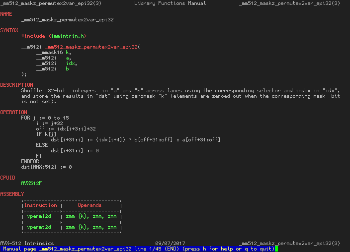

# Intriman

Intriman is a documentation generator that retargets the [Intel Intrinsics Guide](https://software.intel.com/sites/landingpage/IntrinsicsGuide/) data into additional **offline** documentation formats.

---

Man page(groff):


Markdown:


Plaintext:


---

## Dependencies

 * [Cmake 3.2.2+](https://www.cmake.org/download/)
 * [pugixml](https://github.com/zeux/pugixml)

## Building

Clone the repository with submodules:

`git clone --recursive https://github.com/Wunkolo/Intriman.git`

### Windows

Using Visual Studio 2017, simply open `CMakeLists.txt` using Visual Studios [built-in support for opening CMake projects](https://blogs.msdn.microsoft.com/vcblog/2016/10/05/cmake-support-in-visual-studio/):


Finally, select your desired build target and architecture and then build. Compiled binaries will be found in the cache folder:


### Linux

Typical [Cmake out-of-source procedure](http://preshing.com/20170511/how-to-build-a-cmake-based-project/#running-cmake-from-the-command-line):

```
cd Intriman
mkdir build
cd build
cmake ..
make
```

## Usage

Download `https://software.intel.com/sites/landingpage/IntrinsicsGuide/files/data-latest.xml` and simply drag and drop this file onto the executable, or put `data-latest.xml` as the first argument, and the documentation files will be generated( default output directory is `./docs/` relative to the executable path )


